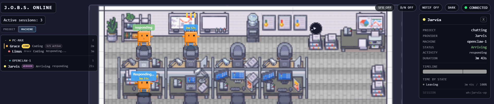
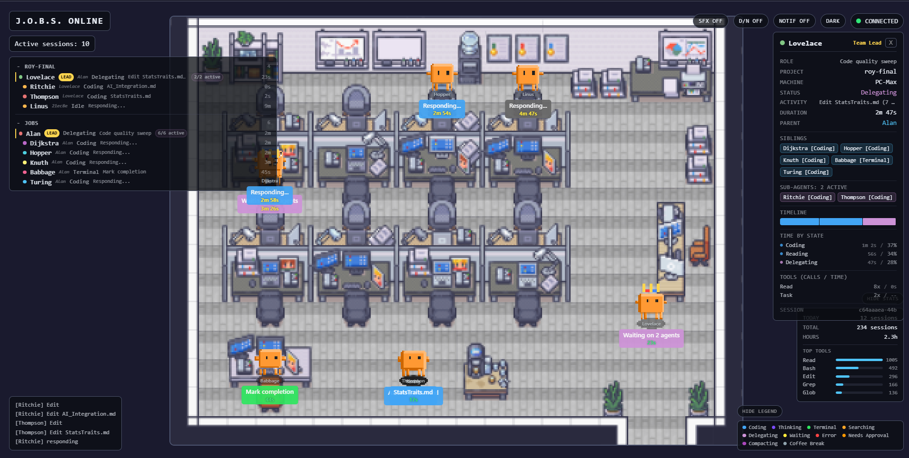
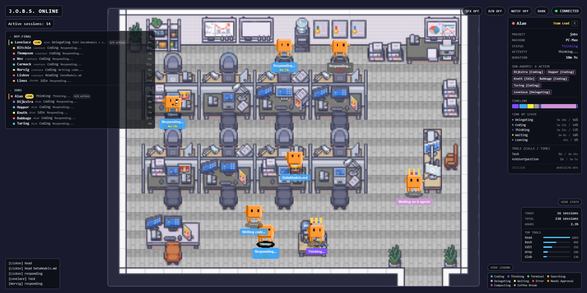
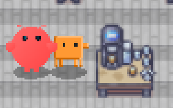

# J.O.B.S. — Jarvis Operations & Bot Surveillance

[](https://github.com/maxthomas95/JOBS/actions/workflows/ci.yml)
[](https://opensource.org/licenses/MIT)



A self-hosted, browser-based pixel-art office that visualizes Claude Code agent activity in real-time. Each active coding session spawns a character who moves between stations — coding at a desk, thinking at a whiteboard, running commands at a terminal, searching at a library, grabbing coffee on a break.

Multiple simultaneous sessions = a bustling office. Perfect for developers running multiple Claude Code sessions, team leads monitoring sub-agent trees, or anyone who wants a living dashboard of their AI workforce.

Part of the [Jarvis](https://github.com/maxthomas95/homelab-jarvis) AI assistant ecosystem.

## Features

- **Live agent visualization** — sprites walk between office stations based on real Claude Code activity
- **Speech bubbles** — thought clouds, tool indicators, and file names above each agent
- **Supervisor mode** — parent agents patrol sub-agent desks, delegate work, and check in
- **Agent detail panel** — click any agent for a dossier: project, tools used, state timeline, team relationships
- **Follow mode** — zoom in and track a single agent with smooth camera following
- **Day/night cycle** — office lighting shifts based on real time of day
- **Themes** — dark (default), bright, cyberpunk (neon glow), retro (CRT scanlines)
- **Tiled map support** — renders Tiled Map Editor `.tmj` files directly, with procedural fallback
- **Ambient audio** — keyboard clacking, coffee brewing, office hum, retro chimes (14 real .ogg samples)
- **Stats dashboard** — sessions today, total hours, files touched, tools used breakdown
- **Webhook adapter** — accept events from any source (CI, deploy, monitoring) via HTTP POST
- **Multi-instance** — watch multiple machines' Claude dirs, with machine grouping in the HUD
- **OpenAI Codex support** — visualize Codex CLI sessions alongside Claude Code
- **Privacy first** — no code, file contents, or full paths ever leave the server

## How It Works

J.O.B.S. has two data paths — both work independently, and they're better together.

### Standard Mode (zero config, works out of the box)

```
Claude Code writes JSONL  →  chokidar detects  →  parser extracts
→  adapter strips sensitive data  →  WebSocket broadcasts
→  Zustand updates  →  PixiJS renders
```

The server watches `~/.claude/projects/**/*.jsonl` for Claude Code session files. Each JSONL line is parsed, stripped of sensitive content (code, file paths, bash commands), and broadcast as a normalized event to all connected browsers. The client maps events to agent states and office locations, driving sprite movement and animation.

### Enhanced Mode (opt-in, via Claude Code hooks)

```
Claude Code hook fires  →  async script POSTs to JOBS server
→  session-manager merges with JSONL data  →  richer, faster updates
```

Claude Code's [hooks system](https://docs.anthropic.com/en/docs/claude-code/hooks) can send events directly to the JOBS server, filling gaps that JSONL file watching can't cover:

- **Instant "waiting for human" detection** — the `Stop` hook fires the moment Claude finishes, replacing an 8-second silence heuristic
- **Deterministic parent-child linking** — `SubagentStart`/`SubagentStop` hooks link teams immediately. Without hooks, subagent JSONL file paths (which embed the parent session UUID) provide reliable linking; the 10-second timing heuristic is now a last-resort fallback
- **"Needs Approval" state** — `Notification` hooks surface permission prompts as a visible agent state (currently invisible via JSONL)
- **Context compaction awareness** — `PreCompact` hook shows when an agent is compressing its memory

All hooks run as `async: true` so they never slow down Claude's work. See [Enhanced Mode Setup](#enhanced-mode-setup) below.

## Quick Start

### Docker (recommended)

```bash
git clone https://github.com/maxthomas95/JOBS.git && cd JOBS
docker compose up -d
```

Open `http://localhost:8780`. The container mounts `~/.claude` read-only.

### Local Development

```bash
npm install
npm run dev
```

This starts both the Vite dev server (port 5173) and the backend (port 8780) via `concurrently`.

To see activity without real Claude Code sessions:

```bash
MOCK_EVENTS=true npm run dev:server
```

Use `MOCK_EVENTS=supervisor` to test team/supervisor scenarios.

### Production Build

```bash
npm run build
npm start
```

## Configuration

All variables are optional. Copy `.env.example` to `.env` to customize.

| Variable | Default | Description |
|---|---|---|
| `PORT` | `8780` | Server port |
| `CLAUDE_DIR` | `~/.claude` | Path to Claude Code data directory |
| `WS_PATH` | `/ws` | WebSocket endpoint path |
| `MOCK_EVENTS` | `false` | Generate fake events (`true`, `supervisor`) |
| `STALE_IDLE_MS` | `300000` | Mark agent idle after this silence (ms) |
| `STALE_EVICT_MS` | `900000` | Remove stale agent after this silence (ms) |
| `MACHINE_ID` | _(auto)_ | Unique ID for this machine (multi-instance) |
| `MACHINE_NAME` | _(hostname)_ | Display name for this machine in the HUD |
| `WEBHOOK_TOKEN` | _(none)_ | If set, `POST /api/webhooks` requires Bearer auth |
| `JOBS_TOKEN` | _(none)_ | If set, enables auth for WebSocket + `/api/hooks` (auto-injected to browser) |
| `WS_MAX_CLIENTS` | `50` | Maximum total WebSocket connections |
| `WS_MAX_PER_IP` | `10` | Maximum WebSocket connections per IP |
| `JOBS_URL` | `http://localhost:8780` | JOBS server URL (used by remote hook scripts) |

## Enhanced Mode Setup

Enhanced mode is optional. JOBS works fully without it — hooks just make it more accurate.

**Automatic setup:**

```bash
node server/setup-hooks.js
```

This adds async hooks to your `~/.claude/settings.json` that POST event metadata to the JOBS server. No sensitive data is sent.

For Codex support:

```bash
node server/setup-hooks.js --codex
```

**Manual setup:** Add to `~/.claude/settings.json`:

```json
{
  "hooks": {
    "Stop": [{ "matcher": "", "hooks": [{ "type": "command", "command": ".claude/hooks/jobs-notify.sh", "async": true }] }],
    "SubagentStart": [{ "matcher": "", "hooks": [{ "type": "command", "command": ".claude/hooks/jobs-notify.sh", "async": true }] }],
    "SubagentStop": [{ "matcher": "", "hooks": [{ "type": "command", "command": ".claude/hooks/jobs-notify.sh", "async": true }] }],
    "Notification": [{ "matcher": "permission_prompt", "hooks": [{ "type": "command", "command": ".claude/hooks/jobs-notify.sh", "async": true }] }]
  }
}
```

**What improves with hooks enabled:**

| Without Hooks | With Hooks |
|---|---|
| "Waiting for human" detected after ~8s silence | Instant detection via `Stop` event |
| Parent-child linking uses 10s timing window | Deterministic via `SubagentStart` |
| Permission prompts invisible | "Needs Approval" agent state |
| Context compaction invisible | "Compacting..." agent state |

## Webhooks

Any external system can send events to JOBS via `POST /api/webhooks`:

```bash
curl -X POST http://localhost:8780/api/webhooks \
  -H "Content-Type: application/json" \
  -d '{"source_id": "ci-main", "event": "build", "state": "running", "activity": "Running tests"}'
```

Webhook agents appear as full office citizens with desks, pathfinding, and bubbles. If `WEBHOOK_TOKEN` is set, include `Authorization: Bearer <token>` or a `token` field in the body.

## Security

J.O.B.S. is designed to be safe for network exposure.

**Authentication (opt-in):** Set `JOBS_TOKEN` in your `.env` to enable shared-token auth. When set:
- WebSocket connections require `?token=<value>` in the URL
- `POST /api/hooks` requires `Authorization: Bearer <token>` header
- Browser clients get the token auto-injected via `<meta>` tag — no manual config needed

Without `JOBS_TOKEN`, everything works open (zero-config default for local use).

**Input validation:** All webhook and hook payloads are sanitized through `server/sanitize.ts`. URLs are validated as http/https only — `javascript:` and `data:` protocols are rejected both server-side and client-side.

**Rate limiting:** API routes are limited to 120 requests/minute/IP. WebSocket connections are capped at 50 total (`WS_MAX_CLIENTS`) and 10 per IP (`WS_MAX_PER_IP`).

**Docker hardening:** The container runs as a non-root user (`jobs`), with a read-only filesystem, all capabilities dropped, `no-new-privileges`, and resource limits (512MB RAM, 1 CPU). Stats persist via a named volume.

**Security headers:** CSP, X-Frame-Options DENY, X-Content-Type-Options nosniff, Referrer-Policy, Permissions-Policy.

## Event-to-Behavior Mapping

| Event | State | Location |
|---|---|---|
| `session.started` | entering | Door → desk |
| `activity.thinking` | thinking | Whiteboard |
| `activity.responding` | coding | Desk |
| `tool.Read/Write/Edit` | coding/reading | Desk |
| `tool.Bash` | terminal | Terminal station |
| `tool.Grep/Glob/WebSearch` | searching | Library |
| `tool.Task` | delegating | Desk (sub-agent spawns) |
| `summary` | cooling | Coffee machine |
| `activity.waiting` | waiting | Coffee machine |
| `agent.error` | error | Current location (red flash) |
| `session.ended` | leaving | → Door (despawn) |

## Tech Stack

- **Frontend:** React 19 + TypeScript + PixiJS 8 (imperative) + Zustand 5
- **Backend:** Node.js + Express + ws
- **Build:** Vite 6
- **File Watching:** chokidar 5
- **Pathfinding:** pathfinding (A* grid)
- **Audio:** Howler.js 2.2
- **Deployment:** Docker, single container, port 8780

## Project Structure

```
server/                 Node.js backend
  bridge/               Extracted from pixelhq-bridge (MIT)
    watcher.ts          chokidar file watcher
    parser.ts           JSONL line parser
    claude-adapter.ts   Privacy-stripping adapter
    pixel-events.ts     Event factories
    types.ts            Shared bridge types
  session-manager.ts    Agent lifecycle + desk assignment
  ws-server.ts          WebSocket broadcast + auth + connection limits
  hook-receiver.ts      POST /api/hooks endpoint
  webhook-receiver.ts   POST /api/webhooks endpoint
  stats-store.ts        Persistent session statistics
  sanitize.ts           Input validation (safeString, safeUrl, safeEnum)
  rate-limit.ts         In-memory rate limiter middleware
  mock-events.ts        Fake event generator for testing
  setup-hooks.js        One-command hooks + Codex setup
  hooks/                Hook notify scripts
    jobs-notify.sh      Shell script for Claude Code hooks
    jobs-notify.js      Node.js alternative
    codex-notify.js     OpenAI Codex notify hook

src/                    React frontend
  engine/               PixiJS rendering
    PixelOffice.tsx     Canvas setup + station config
    AgentSprite.ts      Character sprites + supervisor behavior
    Pathfinder.ts       A* grid pathfinding
    AnimationController.ts  State → animation mapping
    AmbientEffects.ts   Desk glow, wall clock, coffee steam
    DayNightCycle.ts    Time-of-day lighting
    FollowMode.ts       Single-agent camera tracking
    tileset/            Tilemap rendering (6 files)
      TiledMapRenderer.ts   Renders Tiled .tmj maps directly
      ImageTilesetRenderer.ts   LimeZu sprite sheet renderer
      ProceduralTilesetRenderer.ts  Code-drawn fallback
      MapConfig.ts      JSON map configuration
  state/                Zustand stores
    useOfficeStore.ts   Agents, stations, follow mode
    useEventStore.ts    Activity feed / event log
    useAudioStore.ts    Audio preferences + playback
    useConnectionStore.ts  WebSocket connection state
    useDayNightStore.ts Day/night cycle state
    useThemeStore.ts    Theme selection
    useStatsStore.ts    Session statistics
  hooks/
    useWebSocket.ts     WebSocket connection hook
  ui/                   React HUD overlay
    HUD.tsx             Header, roster, feed, controls
    BubbleOverlay.tsx   Speech/thought bubbles above sprites
    AgentDetailPanel.tsx  Agent dossier (click to inspect)
    StatsPanel.tsx      Session statistics dashboard
    ConnectionStatus.tsx  WebSocket health indicator
  audio/                Sound management
    AudioManager.ts     Howler.js wrapper
    sounds.ts           Sound registry + volume config
  themes.ts             Theme definitions (dark, bright, cyberpunk, retro)
  types/                Shared TypeScript types
  assets/
    sprites/            Clawdachi GIF + character data
    audio/              14 .ogg samples (CC0)
```

## Tilesets & Custom Maps

### How rendering works

J.O.B.S. has a three-tier rendering fallback:

1. **Tiled map + tileset images** — if a `.tmj` map and matching PNG sprite sheets are present, the [Tiled Map Editor](https://www.mapeditor.org/) layout renders directly with full detail
2. **JSON map config + tileset images** — if only the PNGs are present, the built-in JSON map config renders using the sprite sheets
3. **Procedural fallback** — if no tileset images exist, the office renders as colored rectangles with the same layout and desk positions

The procedural fallback ships by default and works out of the box — no assets to buy, no setup required. Agents, pathfinding, desk assignment, and all features work identically regardless of which renderer is active.

### Adding the LimeZu tileset

For detailed pixel art, you can add the [LimeZu Modern Office](https://limezu.itch.io/modernoffice) tileset ($2.50):

1. Buy and download the tileset from itch.io
2. Drop the PNG files into `src/assets/tiles/`:
   - `Room_Builder_Office_16x16.png`
   - `Modern_Office_16x16.png`
3. Restart the dev server — the app auto-detects the images and switches renderers

The tileset images are gitignored and never committed to the repo.

### Using your own tileset

You can build a completely custom office layout with [Tiled Map Editor](https://www.mapeditor.org/):

1. Create a `.tmj` map (16x16 tile size, 20x15 grid) with your own tileset PNGs
2. Place the tileset PNGs in `src/assets/tiles/`
3. Replace the map data in `src/assets/maps/office-tiled.json` with your exported `.tmj`
4. Update the station positions in `src/engine/PixelOffice.tsx` — the `TILED_STATIONS` object defines where agents sit, think, and walk:
   - `door` — where agents enter/exit
   - `desks` — array of `{x, y}` grid positions for agent workstations
   - `whiteboard`, `terminal`, `library`, `coffee` — shared stations

If your layout has a different desk arrangement, the `TILED_STATIONS.desks` array is what you need to change. The pathfinding grid and walkability are derived automatically from the Tiled map layers (floor = walkable, desk/wall = blocked).

## Screenshots

| Busy Office | Full House |
|---|---|
|  |  |

| HUD & Roster | Agent Sprites |
|---|---|
|  |  |

## Contributing

See [CONTRIBUTING.md](CONTRIBUTING.md) for development setup, code style, and PR guidelines.

## Roadmap

The full design document lives in [VISION.md](VISION.md). Here's what's ahead.

### Planned Features

Concrete, scoped features planned for future releases:

- **Settings menu** — slide-out panel with per-sound volume sliders, display options, notification preferences
- **Open-source tileset upgrade** — replace procedural colored rectangles with detailed code-drawn pixel art (zero external assets, zero licensing concerns)
- **Demo mode** — `?demo=true` URL param or HUD button to showcase the office without real Claude sessions, with auto-demo on idle for public-facing instances
- **Dashboard / kiosk mode** — full-screen mode optimized for wall-mounted displays, with minimal HUD, auto-rotate agent focus, and auto-hiding cursor

### Moonshots

Big, ambitious features — each would be a marquee addition:

- **Live terminal view** — click a sprite, see its live Claude Code session via xterm.js
- **Clawdachi sprite system** — expressive, state-aware blob characters with per-state particle effects, facial expressions, and personality palettes
- **Live room editor** — WYSIWYG drag-and-drop furniture placement with dynamic pathfinding rebuild
- **Time-lapse replay** — record every event, replay an entire day at high speed with a visual timeline
- **Multi-tool agent adapters** — purpose-built watchers for Cursor, Windsurf, Aider alongside Claude Code and Codex
- **Spectator mode** — shareable, read-only links so teammates can watch your office from anywhere
- **Agent personality system** — persistent traits (speed, anxiety, sociability) that make each agent feel like an individual
- **AI-generated floor plans** — describe your office in natural language, get a valid map layout
- **Outbound notifications** — push alerts to Slack, Discord, or any webhook when agents need attention

### The Whiteboard

Ideas that are scoped and ready to build, waiting for community interest or a rainy weekend:

- **Sound packs** — swap between audio themes (office, retro-arcade, nature) or drop in your own
- **Keyboard shortcuts** — full keyboard control (M mute, T theme, Tab cycle agents, ? help overlay)
- **Stats export** — CSV and JSON export of session history with date range filtering

## License

[MIT](LICENSE)
