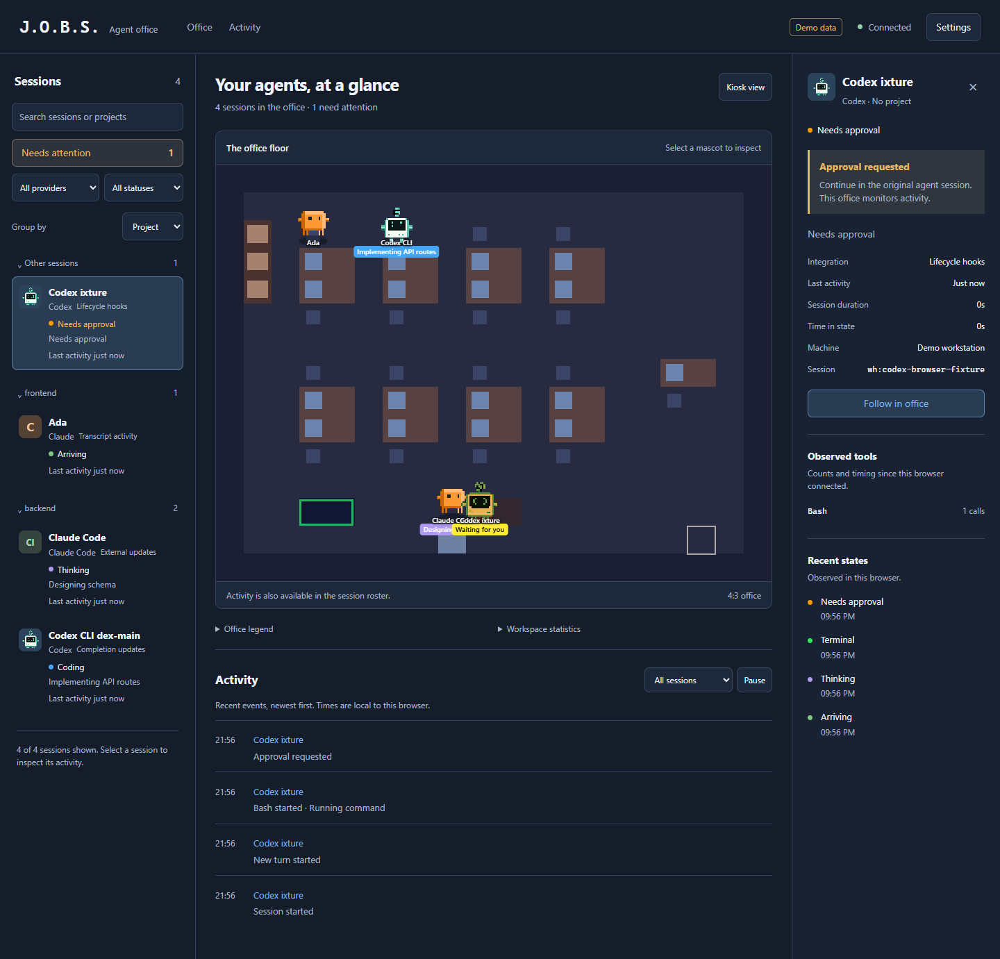

# J.O.B.S. modernization implementation

Approved September 7, 2026, following `reviews/2026-09-07.md` and its UI concept.
Integration branch: `feat/jobs-modernization`. The active `C:\repo\jobs` checkout
is preserved. Parallel work happens in dedicated worktrees and is integrated by
the primary agent after review and validation.

## Delivery checklist

- [x] Preserve review and Codex guidance in a documentation commit.
- [x] Privacy/access: public serializers, safe activity context, real viewer login,
  protected stats/WebSocket/ingestion, Compose configuration, regression tests.
- [x] Correctness: byte-based file tails, per-file serialization, safe lifecycle
  cancellation, shared layout capacity, snapshot cleanup, accurate timing/stats.
- [x] Codex: provider-specific lifecycle hooks, safe completion compatibility,
  ordering/deduplication, parent/child state, nondestructive setup and diagnostics.
- [x] Interface: modern shell, readable/filterable session rail, attention queue,
  inspector, activity, settings, mobile and keyboard/reduced-motion behavior.
- [x] Dependency remediation: narrow groups, runtime dependency pruning, enforce
  the intended audit threshold with no force upgrades.
- [x] Integration: Node 22 tests/lint/build, production CSP/assets fallback,
  authenticated/empty/disconnected/mixed-provider browser checks, docs update.
- [x] Publish reviewable commits/PR; no automatic merge or deployment.

Published as [draft PR #4](https://github.com/maxthomas95/JOBS/pull/4). The PR's
checks are the current CI record for its exact head; this document records the
local validation baseline below.

## Ownership and integration

| Workstream | Branch/worktree | Owner |
| --- | --- | --- |
| Auth, privacy adapters, dependency groups, integration | `feat/jobs-modernization` / `modernization` | Primary agent |
| Watcher, lifecycle, snapshots, stats, shared layout/types | `feat/jobs-lifecycle` / `lifecycle` | Lifecycle subagent |
| Real application UI and presentation | `feat/jobs-interface` / `interface` | Interface subagent |
| Codex bridge, hook scripts, installer, diagnostics | `feat/jobs-codex-hooks` / `codex-hooks` | Codex subagent |

No subagent edits the active checkout. Package manifest/lock and final entrypoint
wiring are primary-owned. Agents coordinate shared types before integration.

## Implementation decisions

- Retain React, imperative PixiJS, Zustand, and native WebSocket.
- Viewer authentication uses explicit token entry and an HttpOnly same-site
  session cookie. Never embed credentials in HTML or browser storage. Hooks use
  bearer credentials; webhooks inherit `JOBS_TOKEN` unless separately configured.
- Keep local zero-config use, bind local processes to loopback by default, and
  require explicit configuration for network deployment. Health remains minimal.
- Use supported Codex lifecycle hooks for passive monitoring, with legacy
  completion notifications clearly labeled as limited capability.
- Use node:test through the existing tsx dependency for focused regressions.
- Keep the pixel-art scene; move everyday controls into a readable app shell.

## Validation and remaining work

Completed implementation in focused commits: review/guidance `2c2edc5`, runtime
dependencies `9a80171`, build dependencies `9e558cc`, access/privacy `c50185e`,
lifecycle/layout `4cec39c`, Codex `d4e302b` and `91c1e99`, project redaction
`7f65738`, persisted stats `193e7c4`, and UI `05e120b`. Integration follow-ups
wire the adapters, add trusted-host checks and bounded auth requests, discover
optional art at build time, and refresh current documentation.

Validation performed using synthetic data and isolated configuration:

| Check | Result |
| --- | --- |
| Node 22.23.2 `npm test` | 41 tests pass: watcher Unicode/partial/restart/truncation, lifecycle timers, privacy/auth, persisted stats, layout reachability, Codex ordering/installer/real session integration, UI labels |
| Node 22 `npm run lint` | Pass, with five existing renderer console warnings |
| Node 22 `npm run build` | Pass with procedural fallback and with locally available optional tiles; existing large-chunk warning remains |
| `npm audit --audit-level=high` | Zero vulnerabilities; CI threshold raised from critical to high |
| Production dependency install | `npm ci --omit=dev --ignore-scripts` succeeds in an isolated directory; runtime manifest excludes dev tooling |
| Production browser + CSP | Real server auth, dynamic socket path, Codex approval/stop/new turn, diagnostics, logout, disconnected state and stalled-auth retry pass; no JavaScript errors |
| Development proxy | Same-origin auth and custom backend/socket path pass through Vite |
| Responsive browser | 1440/1024/760/390/320px: no horizontal overflow; canvas stays 4:3 |
| UI interaction review | Search/provider/state/attention filters, selection/focus/Escape, follow, activity pause/filter, themes/settings, kiosk, empty/offline and reduced motion pass |
| Docker Compose | `docker compose config --quiet` passes; Docker daemon unavailable, so image build/container launch not exercised locally |
| Worktree hygiene | User's active checkout remains clean and unchanged; no real hooks/configuration or transcripts modified |

The Windows Codex launcher was tested under Node 22 using its actual installed
command. That caught and fixed a `node` shell-shim issue; `node.exe` is explicit.
Fixtures also caught late session-end delivery, encoded path disclosure, and
unvalidated private fields in historical stats before publication.

Retained limits: Codex usage and hosted search telemetry are unavailable;
completion-only notify does not report live tools. Hook delivery can be partial
or delayed, and must be enabled/trusted in the user's own Codex installation.
No hook installer was run against real user configuration. Session time is an
observed interval, not a claim of precise billable/model execution time. Daily
totals retain 30 recorded UTC days; tool totals remain cumulative. New network
deployments need a trusted hostname, credential, and HTTPS configuration.

These screenshots use synthetic sessions and the procedural fallback. Purchased
tiles and screenshots containing them are excluded from the PR.

[Phone layout](reviews/screenshots/2026-09-07-office-mobile.png)
